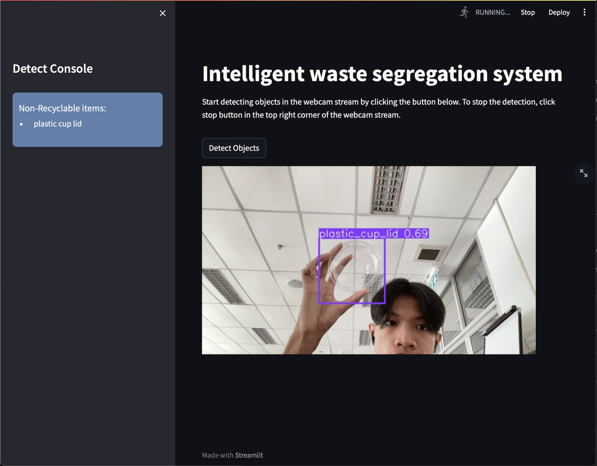

# Intelligent waste segregation system
This project demonstrates waste detection using a YOLOv8 (You Only Look Once) object detection model. It identifies recyclable, non-recyclable, and hazardous waste items in a webcam stream.

Our datasets used to train:
https://universe.roboflow.com/ai-project-i3wje/waste-detection-vqkjo/model/3

Colab:
https://colab.research.google.com/drive/1dHv5QUuz2NkkgzeKBoO4DLAhLg9mOrzv?usp=sharing

Live:
https://intelligent-waste-segregation-system.streamlit.app


## Setup

**Clone the Repository:**
```bash
git clone https://github.com/boss4848/waste-detection.git
cd waste-detection
```
**Install Dependencies:**
```bash
pip install -r requirements.txt
```
**Run the Application**
```bash
streamlit run app.py
```
Open your web browser and navigate to the provided URL (usually http://localhost:8501). You will see the Waste Detection app.

## Project Structure

- `app.py`: Main application file containing Streamlit code.
- `helper.py`: Helper functions for waste detection using the YOLO model.
- `settings.py`: Configuration settings, including the path to the YOLO model and waste types.
- `train.py`: To train the model

## Classifying Waste Items

- **RECYCLABLE**=['cardboard_box','can','plastic_bottle_cap','plastic_bottle','reuseable_paper']
- **NON_RECYCLABLE**=['plastic_bag','scrap_paper','stick','plastic_cup','snack_bag','plastic_box','straw','plastic_cup_lid','scrap_plastic','cardboard_bowl','plastic_cultery']
- **HAZARDOUS**=['battery','chemical_spray_can','chemical_plastic_bottle','chemical_plastic_gallon','light_bulb','paint_bucket']

## Screenshots



## References

- [Streamlit Documentation](https://docs.streamlit.io/)
- [YOLO Documentation](https://github.com/ultralytics/yolov5)

